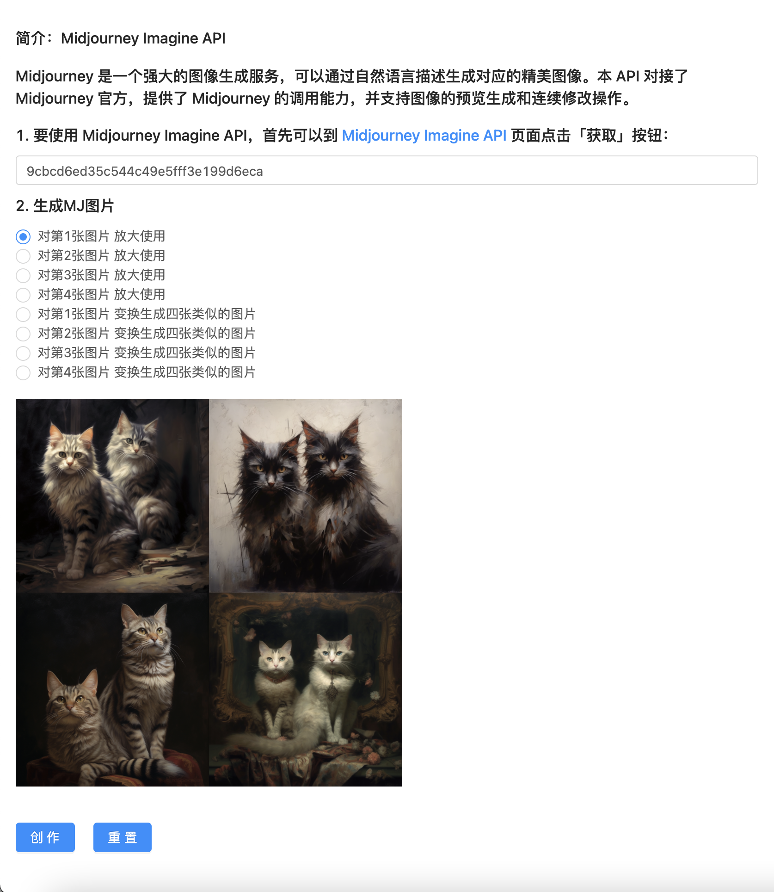

# mj-demo

知数云 MJ画图demo,调用  Midjourney Imagine API 进行画图
## Project setup
```
yarn install
```

### Compiles and hot-reloads for development
```
yarn serve
```

### Compiles and minifies for production
```
yarn build
```
## 预览
