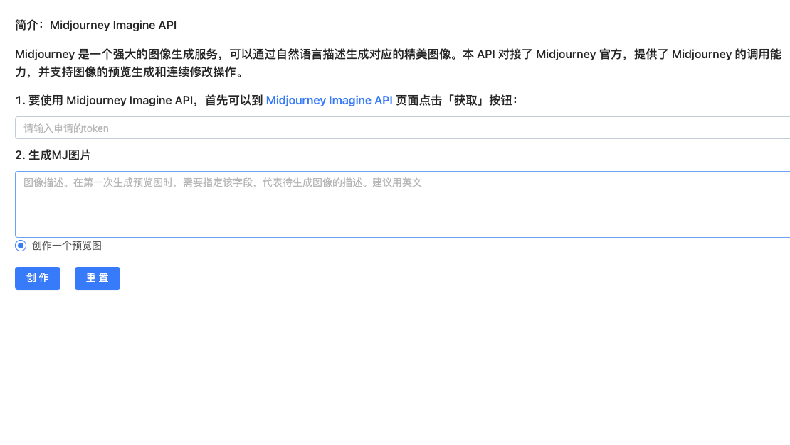

# mj-demo
> 知数云 MJ画图demo,调用  Midjourney Imagine API 进行画图
> 
> 有意向合作，请咨询淡然（🛰qq1160940854）。

## Project 
```
yarn install
```
```
yarn serve
```
```
yarn build
```
## demo线上地址
- [github地址](https://github.com/Gethinguo/mj-demo)
- [demo线上地址](http://39.105.30.5/mj-demo/)
- [demo地址](https://ggx.ink/mj-demo/)
- [知数云](https://data.zhishuyun.com/services)

## 协议

[协议](./LICENSE.md)
## 预览



## 赞助我们
